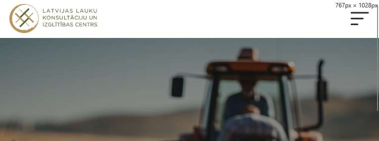
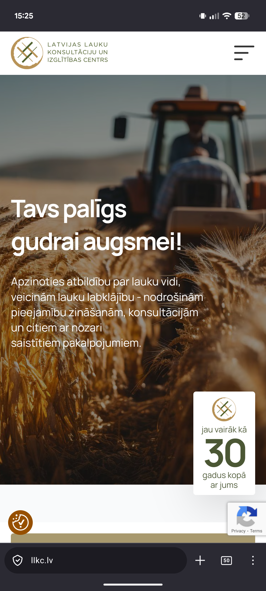
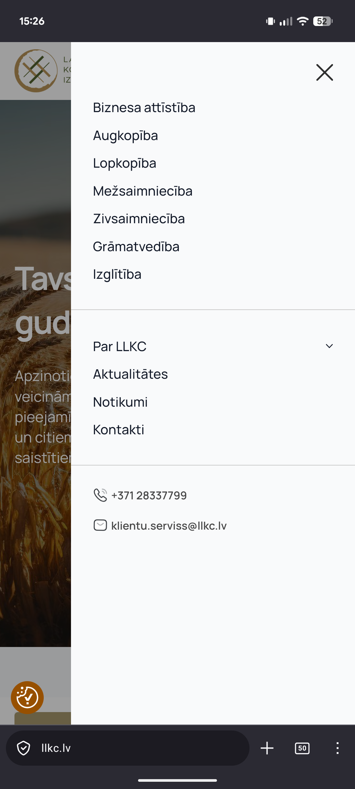

# UX Kļūdas ziņojums: UX-003

**Nosaukums:** Meklēšanas funkcijas nepieejamība mobilajā un planšetdatoru skatā
**Tips:** Functional / Accessibility Issue
**Prioritāte:** Augsta (High)

## 💻 Vide (Environment)
* **OS:** Android 16 (Google Pixel 6) / Windows 11
* **Pārlūks:** Firefox Mobile / Firefox desktop
* **Lūzuma punkts (Breakpoint):** < 768px platums

## 🎯 Apraksts
Samazinot ekrāna platumu zem 768px (kad lapa pārslēdzas uz mobilo navigāciju), meklēšanas lauks pilnībā pazūd no lietotāja redzesloka. Meklēšanas funkcija nav atrodama ne galvenē (*header*), ne "menu"/"hamburgera" izvēlnē.

## 🛠️ Soļi kļūdas izsaukšanai
1. Atvērt mājaslapu `llkc.lv`.
2. Izmantot mobilo ierīci vai pārlūka izstrādātāju rīkus (inspect), lai sašaurinātu logu zem 768px.
3. Mēģināt atrast meklēšanas ikonu vai ievades lauku galvenajā lapā.
4. Atvērt "menu"/"hamburgera" izvēlni un pārbaudīt, vai meklētājs ir ievietots tajā.

## 📈 Faktiskais rezultāts
Meklēšanas funkcija lietotājam kļūst pilnīgi nepieejama. Mobilie lietotāji nevar meklēt informāciju platformā.

## ✅ Gaidāmais rezultāts
Meklēšanas funkcijai ir jābūt pieejamai visos ekrāna izmēros. Standarta risinājums:
1. Pievienot meklēšanas ikonu (lupu) blakus mobilajai izvēlnei.
2. Vai ievietot meklēšanas lauku mobilajā izvēlnē (menu/hamburger).

## 📸 Pierādījumi

---
**Piezīme:** Šī kļūda būtiski ierobežo lapas funkcionalitāti mobilajiem lietotājiem un rada negatīvu lietotāja pieredzi (UX).
